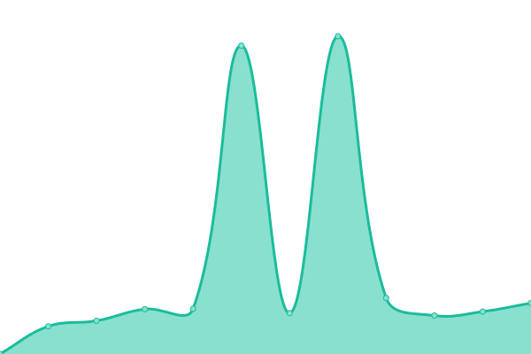

# [📈 Live Status](https://danielpotthast.github.io/upptime): <!--live status--> **🟩 All systems operational**

This repository contains the open-source uptime monitor and status page for [Daniel Potthast](https://www.d-photos.de), powered by [Upptime](https://github.com/upptime/upptime).

With [Upptime](https://upptime.js.org), you can get your own unlimited and free uptime monitor and status page, powered entirely by a GitHub repository. We use [Issues](https://github.com/danielpotthast/upptime/issues) as incident reports, [Actions](https://github.com/danielpotthast/upptime/actions) as uptime monitors, and [Pages](https://danielpotthast.github.io/upptime) for the status page.

<!--start: status pages-->
<!-- This summary is generated by Upptime (https://github.com/upptime/upptime) -->
<!-- Do not edit this manually, your changes will be overwritten -->
<!-- prettier-ignore -->
| URL | Status | History | Response Time | Uptime |
| --- | ------ | ------- | ------------- | ------ |
|  [d-photos.de](https://www.d-photos.de) | 🟩 Up | [d-photos-de.yml](https://github.com/danielpotthast/upptime/commits/HEAD/history/d-photos-de.yml) | 

 1037ms
     
 | 

<a href="https://status.d-photos.de/history/d-photos-de">100.00%</a>
    

|  [fs05.de](https://www.fs05.de) | 🟩 Up | [fs05-de.yml](https://github.com/danielpotthast/upptime/commits/HEAD/history/fs05-de.yml) | 

 967ms
     
 | 

<a href="https://status.d-photos.de/history/fs05-de">99.85%</a>
    

|  [fs05.wiki](https://www.fs05.wiki) | 🟩 Up | [fs05-wiki.yml](https://github.com/danielpotthast/upptime/commits/HEAD/history/fs05-wiki.yml) | 

 1106ms
     
 | 

<a href="https://status.d-photos.de/history/fs05-wiki">99.85%</a>
    

|  [stefanpotthast.de](https://www.stefanpotthast.de) | 🟩 Up | [stefanpotthast-de.yml](https://github.com/danielpotthast/upptime/commits/HEAD/history/stefanpotthast-de.yml) | 

 2530ms
     
 | 

<a href="https://status.d-photos.de/history/stefanpotthast-de">100.00%</a>
    

<!--end: status pages-->

[**Visit our status website →**](https://danielpotthast.github.io/upptime)

## 📄 License

- Powered by: [Upptime](https://github.com/upptime/upptime)
- Code: [MIT](./LICENSE) © [Daniel Potthast](https://www.d-photos.de)
- Data in the `./history` directory: [Open Database License](https://opendatacommons.org/licenses/odbl/1-0/)
